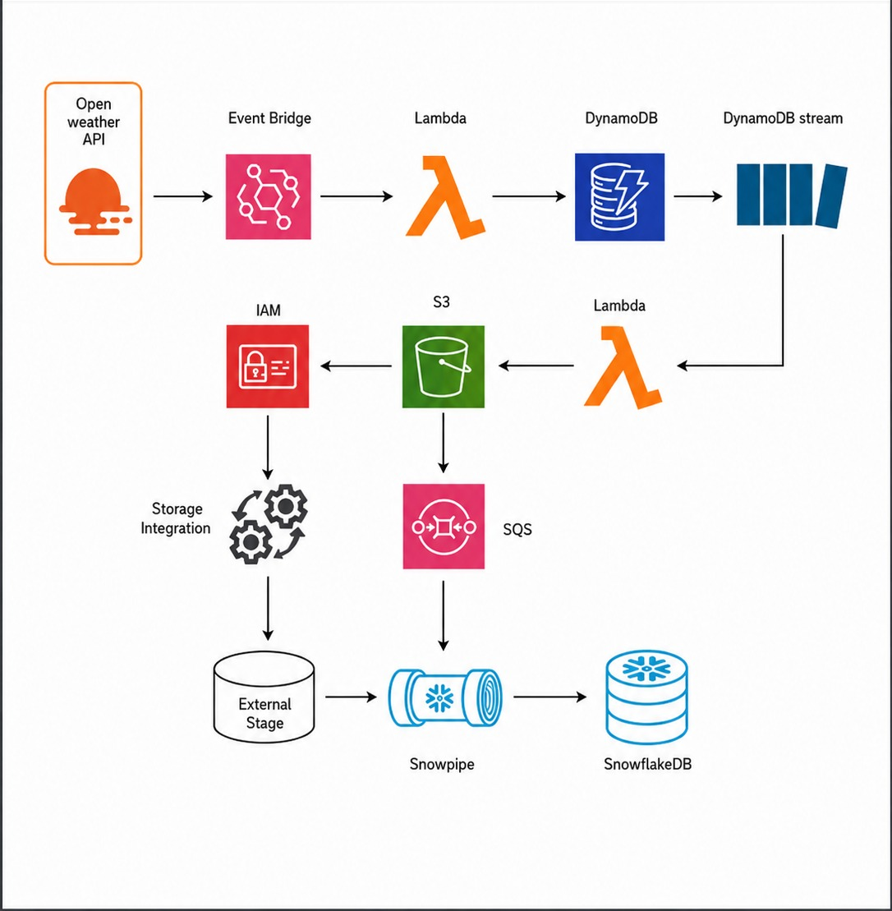

# 🌦️ Weather Data Pipeline (AWS + Snowflake)

## 📌 Project Overview
This project implements a real-time weather data pipeline using AWS services and Snowflake.

The pipeline automatically fetches weather data, processes it through AWS services, stores it in Amazon S3, and ingests it into Snowflake using Snowpipe.

---

## 🏗️ Architecture

EventBridge  
↓  
Lambda (Weather API Fetch)  
↓  
DynamoDB  
↓  
DynamoDB Streams  
↓  
Lambda (Stream Processing)  
↓  
Amazon S3  
↓  
Snowpipe  
↓  
Snowflake

---

## ⚙️ Technologies Used

- AWS Lambda
- Amazon DynamoDB
- DynamoDB Streams
- Amazon S3
- Amazon EventBridge
- Snowflake
- Python

---

## 🚀 Features

- Fetches weather data every 5 minutes
- Processes streaming data using DynamoDB Streams
- Stores JSON data in Amazon S3
- Automatically ingests data into Snowflake using Snowpipe
- Fully automated serverless pipeline

---

## ▶️ Workflow

1. EventBridge triggers Lambda every 5 minutes
2. Lambda fetches weather data from API
3. Data is stored in DynamoDB
4. DynamoDB Streams trigger second Lambda
5. Stream Lambda uploads JSON data to S3
6. Snowpipe loads data into Snowflake

---

## 📂 Project Structure

weather-data-pipeline/
│
├── lambda_weather.py
├── lambda_stream.py
├── snowflake_setup.sql
├── requirements.txt
└── README.md

---

## 👩‍💻 Author

Ananya S